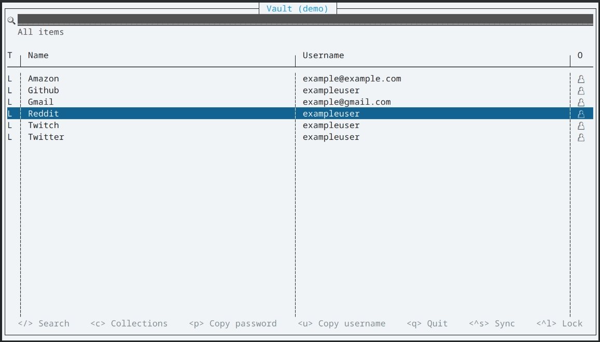

# wden

A read-only TUI for accessing Bitwarden vault contents from the terminal.

**WARNING: This application is experimental and has not been audited. Use at your own risk.**



---

## Usage

```
./wden --help
wden 

USAGE:
    wden [OPTIONS]

OPTIONS:
    -h, --help                       Print help information
        --list-profiles              Instead of starting the application, list all stored profiles
    -p, --profile <PROFILE>          Sets the profile that will be used. Profile names can only
                                     include lowercase alphanumeric characters, dashes (-) and
                                     underscores (_) [default: default]
    -s, --server-url <SERVER_URL>    Sets the Bitwarden server url. If not set, the url stored in
                                     the profile will be used. If a new profile is created without a
                                     server url set, https://vault.bitwarden.com will be used
```

### With Bitwarden Cloud

Just run the wden binary.
```
./wden
```

Wden will create a new profile (named `default`), with the Bitwarden Cloud configured as the server.

### With a self-hosted Bitwarden-compatible server

Run the wden binary, and set the server URL with the `-s` flag. The flag has to be passed only on the first launch, because wden will store the server URL in the configuration.

```
./wden -s https://my-own-bitwarden.example.com
```

Wden will create a new profile (named `default`) with the given server URL.

### With multiple profiles

Multiple profiles with different settings can be used when connecting to multiple Bitwarden instances or with multiple users. For example, this allows quickly accessing a personal and a work Bitwarden vault. Wden will remember configuration values (server URL, lock timeout, ...), login email addresses and two-factor logins separately for each profile.

When launching wden, specify the profile name with the `-p` flag. The name may only include lowercase characters (`a-z`), digits, dashes and underscores. The server URL may be set with the `-s` flag on the first launch, but it's not necessary on subsequent launches.

```
./wden -p personal -s https://my-own-bitwarden.example.com
```

All existing profiles can be listed with the `--list-profiles` parameter.

### Configuration files

Configuration files, one for each profile, are stored under the user's config directory (by default, `~/.config/wden` on Linux and `%appdata%\wden` on Windows).

---

## Features

- Listing Login, Identity, Card, and Note items
- Copy usernames and passwords
    - Bypasses clipboard history in Windows and KDE Plasma
- View organization items
- Fuzzy search
- 2FA login (only authenticator code apps supported)
- Connect to self-hosted Bitwarden instances (configurable URLs)
- Automatic vault locking after a configurable period
- Multiple profiles (configurations)

## Todo

- Collection support
- Folder support
- Additional 2FA methods
- Local vault caching / offline support?
- Attachment support
